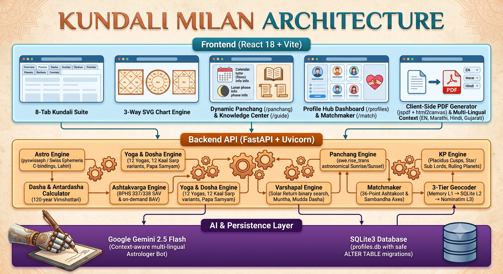

# ✦ Kundali Milan — Vedic Astrology, KP, Varshapal & Matchmaking Suite

[](https://github.com/Shevadesuyash/Kundali)
[](https://fastapi.tiangolo.com)
[](https://reactjs.org)
[](https://www.astro.com/swisseph/)
[](https://ai.google.dev/)
[](LICENSE)

A modern, high-precision, enterprise-grade Vedic Astrology (Jyotish) suite built with **FastAPI**, **Swiss Ephemeris (`pyswisseph`)**, **React 18**, **Vite**, and **Google Gemini 2.5 Flash**.

Features high-precision sidereal planetary calculations (Lahiri Ayanamsha), modular **8-Tab Kundali Analysis**, **3-Way Regional Chart Formats** (North, South, East Indian), **Krishnamurti Paddhati (KP System)**, **Tajika Varshapal (Annual Solar Return)**, **Dynamic Astronomical Panchang**, **36-Point Ashtakoot Guna Milan & Jyotish Comparative Matrix**, **Live Transits & Sade Sati**, **Client-Side PDF Export**, **Contextual Help Guides**, and **4-Language Native Localization** (_English, Marathi, Hindi, Gujarati_).

---

## 🤖 Built with Google Antigravity AI

This project was engineered, evolved, and polished using **Google Antigravity**, combining agentic pair-programming with deep domain mathematical engineering. Every layer — from high-precision astronomical C-bindings (`pyswisseph`) to custom SVG chart layout engines and multi-language AI prompts — was iteratively built and strictly tracked in an append-only technical ledger (`docs/PROJECT_STATUS.md`).

---

## ✨ Features & Core Capabilities

### 1. 🪐 Modular 8-Tab Kundali Report Suite

- **Tab 1: Overview & Regional Charts**:
  - Birth metadata, classification badges (_Varna, Gana, Nadi, Moon Lord_), and 12-house summary strip.
  - Interactive **3-Way Regional Chart Switcher**:
    - 💎 **North Indian Diamond Chart** (Fixed Houses, Rotating Signs)
    - 🔲 **South Indian Box Chart** (Fixed Signs, Clockwise Houses)
    - 🏛️ **East Indian Bengali / Odia Chart** (Fixed Signs, Rectangular Geometry)
    - Switch seamlessly across **D1 Lagna**, **D9 Navamsha**, and **Chandra Lagna (Moon Chart)**.
  - Real-time **Live Transit & Saturn Sade Sati Banner**.
- **Tab 2: Planets & Strength**:
  - Full planetary positions table with exact degrees, retrograde motion (`℞ Vakri`), absolute longitude, Nakshatras & Padas, and classical dignities (_Exalted, Moolatrikona, Own Sign, Great Friend, Friend, Neutral, Enemy, Great Enemy, Debilitated_).
  - **Sarvashtakvarga (SAV)**: 12-house strength heatmap based on classical BPHS 337/338 points ($\ge 28$ Strong, $25-27$ Average, $< 25$ Low).
  - **On-Demand Bhinnashtakvarga (BAV)**: 1-click on-demand expansion of complete $8 \times 12$ bindu matrices for all 7 classical planets from all 8 reference points.
- **Tab 3: Dasha & Predictive Yogas**:
  - Interactive **Vimshottari Dasha Tree** (120-year cycle): All 9 Mahadashas $\times$ 9 Antardashas (81 sub-periods total) with real-time percentage elapsed progress and calendar start/end dates.
  - Automated **Classical Vedic Yoga Detector**: Analyzes Raja Yogas, Dhana Yogas, Gaja Kesari, Budhaditya, Pancha Mahapurusha (_Ruchaka, Bhadra, Hamsa, Malavya, Shasha_), Chandra-Mangala, and Amala Yogas.
- **Tab 4: Doshas & Vedic Remedies**:
  - Standard Parashari **Mangal (Kuja) Dosha** evaluation across Lagna, Moon, and Venus charts with **Papa Samyam** weighted score breakdown (Houses 1, 4, 7, 8, 12; Mars in House 2 is strictly not Manglik).
  - Special afflictions: **12 Classical Kaal Sarp Variants** (_Anant, Kulik, Vasuki, Shankhpal, Padma, Mahapadma, Takshak, Karkotak, Shankachood, Ghatak, Vishdhar, Sheshnag_), Guru Chandal, Kemadruma, and Pitra Dosha.
  - **Gemstone & Rudraksha Recommendation Engine**: Functional benefic gemstone prescriptions (_Life, Fortune, Intellect, Career stones_) with Dusthana (6, 8, 12) safety contraindications.
- **Tab 5: Natal Panchang**:
  - Panchang at the exact moment and place of birth with Short / Full Detail toggle.
- **Tab 6: Krishnamurti Paddhati (KP System)**:
  - 12 Placidus unequal house cusps with exact degree boundaries.
  - Sign Lord, Nakshatra Star Lord, **KP Sub Lord (Upaswami)**, and Sub-Sub Lord for all 12 cusps and 9 planets.
  - Instant **KP Ruling Planets (RP)** at chart time and **4-Fold House Significators**.
- **Tab 7: Tajika Varshapal (Annual Solar Return)**:
  - Exact astronomical Solar Return moment (**Varsha Pravesh IST**) computed via binary search on transit Sun longitude.
  - **Varsha Lagna**, **Muntha Sign Progression & Lord**, and annual **360-day Mudda Dasha timeline** with interactive year selector.
- **Tab 8: Health & Wellness**:
  - Ayurvedic constitution (**Prakriti: Vata, Pitta, Kapha**), organ susceptibility, 6th/8th house health indicators, and physical wellness markers.

---

### 2. 📿 Dynamic Astronomical Daily Panchang (`/panchang`)

- High-precision astronomical Sunrise, Sunset, and Sun/Moon sidereal coordinates computed via Swiss Ephemeris `swe.rise_trans` for any geographic coordinate worldwide.
- **Location Selector & 10 City Presets**: Typeahead search or quick-select chips for _Pune, Mumbai, New Delhi, Bengaluru, Kolkata, Chennai, Ahmedabad, London, New York, Dubai_.
- **The 5 Limbs (Panch-Anga)**: Tithi (with Paksha), Vara & Day Lord, Nakshatra (with Pada), Yoga, and Karana.
- **Auspicious & Inauspicious Muhurtas**: Brahma Muhurta, Abhijit Muhurta, Rahu Kaal, Yamaganda, Gulika Kaal.
- **Daytime Choghadiya Table**: 8 daytime slots (_Amrit, Shubh, Labh, Char, Rog, Kaal, Udveg_) with nature, timing, and recommended activities.
- **Daily Devotion & Vedic Mantra**: Ruling deity, daily Vedic mantra, and recommended spiritual rituals.

---

### 3. 🔮 Professional Matchmaking & Jyotish Matrix (`/match`)

- **Ashtakoot Guna Milan (36 Points)**: 8-Koota compatibility scorecard (_Varna, Vashya, Tara, Yoni, Graha Maitri, Gana, Bhakoot, Nadi_).
- **Parashari Papa Samyam Differential**: Weighted malefic score differential ($|S_{Groom} - S_{Bride}| \le 25$ points indicates harmonious karmic equilibrium).
- **Side-by-Side Planetary Sambandha Matrix**:
  - Groom vs Bride planetary placements, Nakshatras, and Padas.
  - Mutual House Axes: **1-7 (Saptama)**, **5-9 (Navapanchama)**, **3-11 (Labha-Sahaja)**, **6-8 (Shadashtaka)**, **2-12 (Dwirdwadashta)**.
- **Dual Partner Slot**: Select from saved profile registry or enter manual details with instant 1-click partner swapping (`⇅ Swap Partners`).
- **Opt-In Gemini AI Compatibility Reading**: AI-generated relationship analysis with executive summary and remedies.
- **Client-Side Match PDF Export**: High-resolution multi-page printable PDF download.

---

### 4. 🗃️ Profile Registry & Dashboard Hub (`/profiles`)

- **Live Stats Bar**: Real-time counter of _Total Saved Profiles_, _♂ Male Profiles_, and _♀ Female Profiles_.
- **Relationship Tag Filters**: Filter by _Self_, _Family_, _Friend_, _Partner_, _Client_.
- **Rich Dashboard Cards**: Immediate display of Lagna, Rāśi, Nakshatra, Active Mahadasha, Manglik status, and real-time Sade Sati badge.
- **Quick Match Tray**: Select Groom and Bride cards to view inline scorecards or launch bulk matching.
- **Multi-Profile Bulk Compatibility Matrix (`POST /api/v1/match-bulk`)**: Match an anchor profile against all saved candidates of the opposite gender with a sortable leaderboard.
- **Typeahead Search Auto-Fill**: Name search auto-completes birth details in Kundali and Matchmaker forms with an override badge system.
- **SQLite Persistence**: Safe schema migrations ensure profiles are never lost on server restart.

---

### 5. 📖 Vedic Knowledge Center (`/guide`) & Contextual Help

- **Vedic Astrology Knowledge Center (`/guide`)**: Visual beginner and astrologer guide explaining the 12 Bhavas (Houses), 9 Grahas (Planets), Ashtakvarga SAV benchmarks, Vimshottari Dashas, and Guna Milan rules.
- **Contextual Help Popovers (`AstroTooltip`)**: Interactive `?` popovers across reports explaining technical astrological terms.
- **Expandable Help Cards (`HelpAccordion`)**: Embedded at the top of every report tab and match section to guide new users on how to interpret each calculation.

---

### 6. 🤖 Interactive Gemini 2.5 Flash Astrologer Bot

- **Floating Action Drawer (`✨ Ask Astrologer`)**: Interactive context-aware assistant embedded in the Kundali report.
- **Zero Hallucination Architecture**: AI is fed only verified, pre-computed astronomical facts (Lagna, planets, current Mahadasha, transits, yogas, Papa points).
- **Structured Response Format**: Returns a crisp **`### ⚡ Executive Summary`** first, followed by categorized factors, timing, and Vedic remedies under 250 words.
- **Multi-Lingual Generation**: Responds directly in fluent **Marathi**, **Hindi**, **Gujarati**, or **English** based on the active language setting.
- **Security**: `GEMINI_API_KEY` loaded strictly from gitignored `.env`.

---

### 7. 🌐 Native 4-Language Vedic Localization

- Instant, zero-overhead language switching between:
  - 🇬🇧 **English (`en`)**
  - 🇮🇳 **Marathi (`mr`) — मराठी**
  - 🇮🇳 **Hindi (`hi`) — हिंदी**
  - 🇮🇳 **Gujarati (`gu`) — ગુજરાતી**
- 100% authentic Jyotish terminology (e.g. _सूर्य, चंद्र, मंगळ, राशी, नक्षत्र, नवांश, अष्टकवर्ग_) across all 8 tabs, tables, forms, and match scorecards with 0 layout shift.

---

## 🏛️ Architecture & Tech Stack



## 🚀 Quickstart & Setup Guide

### 1. Prerequisites

- **Python** (v3.10 or higher)
- **Node.js** (v18.0 or higher) & `npm`
- **Gemini API Key** (optional, for AI Astrologer Bot)

---

### 2. Backend Setup (`kundali_backend`)

```bash
cd kundali_backend

# 1. Create and activate virtual environment (optional)
python -m venv venv
# Windows: .\venv\Scripts\activate
# macOS/Linux: source venv/bin/activate

# 2. Install dependencies
pip install -r requirements.txt

# 3. (Optional) Set your Gemini API Key in .env
echo "GEMINI_API_KEY=your_gemini_api_key_here" > .env

# 4. Start the FastAPI backend server
uvicorn app.main:app --port 8000 --reload
```

- Backend API: **[http://localhost:8000](http://localhost:8000)**
- Interactive Swagger API Docs: **[http://localhost:8000/docs](http://localhost:8000/docs)**
- Health Probe: **[http://localhost:8000/health](http://localhost:8000/health)**

---

### 3. Frontend Setup (`kundali_frontend`)

```bash
cd kundali_frontend

# 1. Install dependencies
npm install

# 2. Start Vite development server
npm run dev
```

- Web Application: **[http://localhost:5173](http://localhost:5173)**

---

## 📡 REST API Reference

| Method   | Endpoint                  | Description                                                                               |
| -------- | ------------------------- | ----------------------------------------------------------------------------------------- |
| `GET`    | `/health`                 | Service health probe `{"status": "ok"}`                                                   |
| `POST`   | `/api/v1/kundali`         | Computes full 8-tab Kundali report payload with charts, dignities, SAV, and transits      |
| `POST`   | `/api/v1/ashtakvarga`     | On-demand full Bhinnashtakvarga (7 planets $\times$ 8 references $\times$ 12 signs) + SAV |
| `POST`   | `/api/v1/match`           | 36-Point Ashtakoot Guna Milan + Papa Samyam for two birth detail sets                     |
| `POST`   | `/api/v1/match-saved`     | Guna Milan for two saved profile IDs (`boy_id`, `girl_id`)                                |
| `POST`   | `/api/v1/match-bulk`      | Matches anchor profile against all saved opposite-gender candidates                       |
| `GET`    | `/api/v1/panchang`        | Astronomical Panchang for target date & global coordinates (`date`, `lat`, `lon`, `tz`)   |
| `POST`   | `/api/v1/kp`              | KP Placidus house cusps, Sub Lords, Ruling Planets, and 4-Fold Significators              |
| `POST`   | `/api/v1/varshapal`       | Tajika Solar Return chart, Varsha Pravesh, Muntha, and Mudda Dasha timeline               |
| `POST`   | `/api/v1/ai-chat`         | Multi-lingual Gemini 2.5 Flash Astrologer Bot Q&A based on computed chart facts           |
| `GET`    | `/api/v1/transits/live`   | Real-time 9-graha Gochara, 3-phase Saturn Sade Sati, Dhaiya, and Jupiter transit          |
| `GET`    | `/api/v1/profiles`        | List/search saved profiles with pagination, gender filter, and tag filter                 |
| `POST`   | `/api/v1/profiles`        | Save a new birth profile to SQLite                                                        |
| `GET`    | `/api/v1/profiles/search` | Fast typeahead profile lookup for form auto-completion                                    |
| `GET`    | `/api/v1/profiles/{id}`   | Get single profile birth details                                                          |
| `PATCH`  | `/api/v1/profiles/{id}`   | Partially update profile (recomputes astro metadata)                                      |
| `DELETE` | `/api/v1/profiles/{id}`   | Hard delete profile from SQLite                                                           |
| `GET`    | `/api/v1/geocode`         | 3-tier cached location lookup (`q` query string)                                          |

---

## 🧮 Astrological Ground Truth & Rules

1. **Strict Male / Female Gender**: Required for directional Ashtakoot (Yoni animal matching, Varna/Tara order) and Papa Samyam absorption.
2. **Ephemeris Standard**: Swiss Ephemeris (`pyswisseph`) with standard **Lahiri (Chitrapaksha) Ayanamsha**.
3. **Manglik School**: Standard Parashari rules (evaluated from Lagna, Moon, and Venus across houses 1, 4, 7, 8, 12; Mars in House 2 is strictly **not** Manglik).
4. **Papa Samyam Formula**:
   $$\text{Total Papa Points} = S_{\text{Lagna}} + (0.75 \times S_{\text{Moon}}) + (0.50 \times S_{\text{Venus}})$$
5. **Vimshottari Dasha Formula**:
   $$\text{Antardasha Duration (Years)} = \frac{\text{Mahadasha Years} \times \text{Sub-Planet Years}}{120}$$
6. **Ashtakvarga (BPHS)**:
   - Full 8 reference points (Sun, Moon, Mars, Mercury, Jupiter, Venus, Saturn, Lagna).
   - SAV benefic thresholds: $\ge 28$ points (Strong), $25-27$ points (Average), $< 25$ points (Weak/Caution).
7. **Panchang Sun Timings**: Computed using high-precision astronomical disc center rising/setting algorithms (`swe.rise_trans`).

---

## 📁 Repository File Structure

```
Kundali/
├── README.md                      # Comprehensive Project Documentation
├── GEMINI.md                      # Project Directives & Core Rules
├── docs/
│   └── PROJECT_STATUS.md          # Single Source of Truth & Append-Only Ledger
├── kundali_backend/               # FastAPI Backend Service
│   ├── app/
│   │   ├── main.py                # FastAPI Application & 13 REST Endpoints
│   │   ├── models.py              # Pydantic v2 Schemas & Data Models
│   │   ├── database.py            # SQLite Persistence Layer & Migrations
│   │   ├── astro_engine.py        # Swiss Ephemeris Wrapper & Technical Profiles
│   │   ├── kundali_analyzer.py    # Report Orchestrator
│   │   ├── dasha.py               # Vimshottari Mahadasha & Antardasha Engine
│   │   ├── yoga_engine.py         # Classical Vedic Yoga & 12 Kaal Sarp Detector
│   │   ├── ashtakvarga_engine.py  # BPHS Ashtakvarga (SAV & BAV) Engine
│   │   ├── chart_engine.py        # D1, D9, and Chandra Chart Formatter
│   │   ├── matchmaker.py          # Ashtakoot Guna Milan & Papa Samyam Engine
│   │   ├── ashtakoot.py           # 8-Koota Matching Algorithm
│   │   ├── kp_engine.py           # Krishnamurti Paddhati (Placidus, Sub Lords, RP)
│   │   ├── varshapal_engine.py    # Tajika Solar Return, Muntha & Mudda Dasha
│   │   ├── panchang_engine.py     # Astronomical Panchang (swe.rise_trans)
│   │   ├── gemstone_engine.py     # Gemstone & Rudraksha Recommendation Engine
│   │   ├── transit_engine.py      # Real-Time Gochara & Sade Sati Tracker
│   │   ├── health_analyzer.py     # Ayurvedic Prakriti & Health Engine
│   │   ├── ai_service.py          # Gemini 2.5 Flash Astrologer Bot
│   │   └── geocode_service.py     # 3-Tier Geocoding Engine
│   ├── tests/                     # 56 Backend Pytest Unit Tests
│   ├── profiles.db                # SQLite Database (Persisted)
│   └── requirements.txt           # Python Dependencies
└── kundali_frontend/              # React 18 + Vite Frontend Application
    ├── src/
    │   ├── api/kundaliApi.js      # REST API Client
    │   ├── pages/
    │   │   ├── HomePage.jsx       # Landing Page
    │   │   ├── KundaliPage.jsx    # 8-Tab Kundali Report Page
    │   │   ├── MatchPage.jsx      # Dual Matchmaking & Jyotish Matrix Page
    │   │   ├── PanchangPage.jsx   # Standalone Dynamic Panchang Page
    │   │   ├── ProfilesPage.jsx   # Profile Registry Dashboard Hub
    │   │   └── GuidePage.jsx      # Vedic Astrology Knowledge Center
    │   ├── components/
    │   │   ├── KundaliReport.jsx  # 8-Tab Report Container
    │   │   ├── ReportTabs.jsx     # Tab Navigation Component
    │   │   ├── tabs/              # Overview, Planets, Dasha, Doshas, KP, Varshapal, Health
    │   │   ├── ChartGrid.jsx      # 3-Way Chart Switcher
    │   │   ├── NorthIndianChart.jsx# North Indian Diamond SVG Chart
    │   │   ├── SouthIndianChart.jsx# South Indian Box SVG Chart
    │   │   ├── EastIndianChart.jsx # East Indian Bengali/Odia Rectangular SVG Chart
    │   │   ├── AIAssistant.jsx    # Context-Aware Gemini AI Astrologer Drawer
    │   │   ├── JyotishMatchMatrix.jsx# Side-by-Side Comparative Match Matrix
    │   │   ├── AstroTooltip.jsx   # Contextual '?' Terminology Popovers
    │   │   ├── HelpAccordion.jsx  # Expandable Beginner & Astrologer Guide Cards
    │   │   ├── ExportPDFButton.jsx# Client-Side High-Res PDF Export
    │   │   ├── BulkMatchMatrix.jsx# Multi-Profile Compatibility Leaderboard
    │   │   ├── TransitTracker.jsx # Live Gochara & Sade Sati Tracker
    │   │   ├── GemstonePanel.jsx  # Gemstone & Rudraksha Recommendation Panel
    │   │   ├── DashaTree.jsx      # Interactive Vimshottari Tree
    │   │   ├── AshtakvargaGrid.jsx# SAV Heatmap & On-Demand BAV Matrices
    │   │   ├── YogaList.jsx       # Vedic Yogas & Malefic Doshas Cards
    │   │   ├── ProfileCard.jsx    # Rich Dashboard Profile Card
    │   │   ├── BirthDetailsForm.jsx# Auto-Fill Birth Details Form
    │   │   ├── PartnerSlot.jsx    # Dual-Mode Match Partner Card
    │   │   └── Navbar.jsx         # Navigation Bar with Native 4-Language Switcher
    │   ├── context/
    │   │   └── LanguageContext.jsx# React Context for Language State
    │   ├── utils/
    │   │   ├── i18n.js            # 4-Language Translation Dictionaries (EN, MR, HI, GU)
    │   │   ├── astrology.js       # Helper utilities
    │   │   └── pdfExport.js       # Multi-Tab PDF Generator
    │   └── styles/                # CSS Tokens & Parchment Design System
    ├── package.json
    └── vite.config.js
```

---

## 📜 Astrological Disclaimer

This application calculates astronomical and sidereal planetary coordinates using high-precision algorithms (Swiss Ephemeris with Lahiri Ayanamsha). Interpretations, yogas, doshas, and remedies are based on classical Vedic Jyotish literature and are intended for cultural, educational, and informational purposes. Consult a professional astrologer for major life decisions.

---

## 📄 License

This project is open source and available under the [MIT License](LICENSE).
